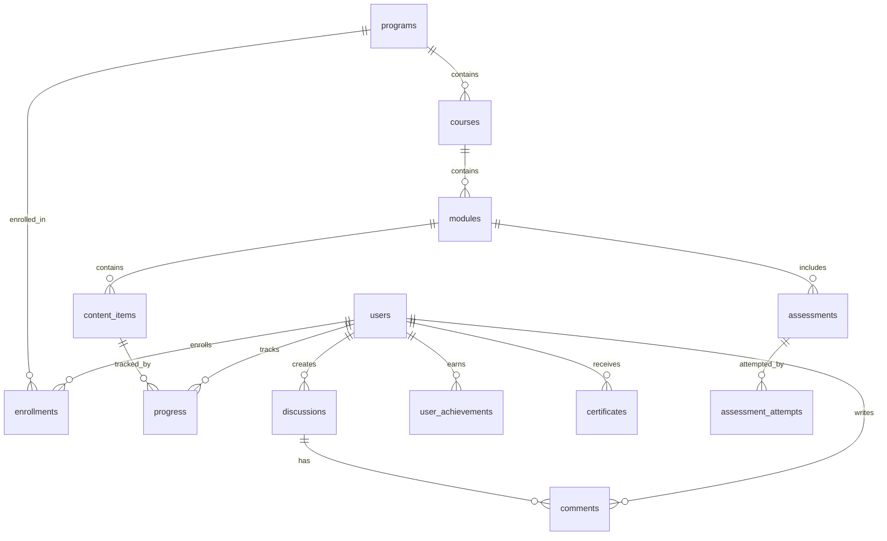

# Culture Degree Database Schema

## Overview

The database schema is designed to support a flexible educational platform that can accommodate various cultural learning paths, user progress tracking, and content management.

## Core Entities

### Users
```sql
users
- id (UUID, PK)
- email (unique)
- name
- avatar_url
- created_at
- updated_at
- last_login_at
- is_active
- preferred_language
- timezone
```

### Authentication (via NextAuth.js)
```sql
accounts (OAuth accounts)
- id
- user_id (FK -> users)
- type
- provider
- provider_account_id
- access_token
- refresh_token
- expires_at

sessions
- id
- session_token (unique)
- user_id (FK -> users)
- expires
```

### Educational Content

#### Programs (Degree-like Learning Paths)
```sql
programs
- id (UUID, PK)
- slug (unique)
- title
- description
- overview (JSON) # Rich content
- difficulty_level (beginner|intermediate|advanced)
- estimated_duration_weeks
- thumbnail_url
- is_published
- created_at
- updated_at
- created_by (FK -> users)
```

#### Courses (Within Programs)
```sql
courses
- id (UUID, PK)
- program_id (FK -> programs)
- slug (unique within program)
- title
- description
- order_index
- estimated_hours
- prerequisites (JSON) # Array of course IDs
- learning_objectives (JSON)
- is_published
- created_at
- updated_at
```

#### Modules (Within Courses)
```sql
modules
- id (UUID, PK)
- course_id (FK -> courses)
- title
- description
- order_index
- type (lesson|quiz|project|discussion)
- estimated_minutes
- is_published
- created_at
- updated_at
```

#### Content Items
```sql
content_items
- id (UUID, PK)
- module_id (FK -> modules)
- type (text|video|audio|image|interactive|document)
- title
- content (JSON) # Flexible content structure
- order_index
- duration_seconds (for video/audio)
- created_at
- updated_at
```

### User Progress Tracking

#### Enrollments
```sql
enrollments
- id (UUID, PK)
- user_id (FK -> users)
- program_id (FK -> programs)
- enrolled_at
- target_completion_date
- status (active|paused|completed|dropped)
- completion_percentage
- last_activity_at
```

#### Progress
```sql
progress
- id (UUID, PK)
- user_id (FK -> users)
- content_item_id (FK -> content_items)
- module_id (FK -> modules)
- course_id (FK -> courses)
- started_at
- completed_at
- time_spent_seconds
- is_completed
- progress_data (JSON) # For interactive content
```

#### Assessments
```sql
assessments
- id (UUID, PK)
- module_id (FK -> modules)
- title
- type (quiz|project|peer_review)
- instructions (JSON)
- passing_score
- max_attempts
- time_limit_minutes
- created_at
- updated_at
```

#### Assessment Attempts
```sql
assessment_attempts
- id (UUID, PK)
- user_id (FK -> users)
- assessment_id (FK -> assessments)
- started_at
- submitted_at
- score
- passed
- answers (JSON)
- feedback (JSON)
- attempt_number
```

### Community Features

#### Discussions
```sql
discussions
- id (UUID, PK)
- module_id (FK -> modules, nullable)
- course_id (FK -> courses, nullable)
- user_id (FK -> users)
- title
- content (JSON)
- is_pinned
- is_locked
- created_at
- updated_at
```

#### Comments
```sql
comments
- id (UUID, PK)
- discussion_id (FK -> discussions)
- user_id (FK -> users)
- parent_id (FK -> comments, nullable) # For replies
- content (JSON)
- is_edited
- created_at
- updated_at
```

### Achievements & Certifications

#### Achievements
```sql
achievements
- id (UUID, PK)
- name
- description
- icon_url
- type (course_completion|streak|community|special)
- criteria (JSON)
- points
```

#### User Achievements
```sql
user_achievements
- id (UUID, PK)
- user_id (FK -> users)
- achievement_id (FK -> achievements)
- earned_at
- progress (JSON) # For progressive achievements
```

#### Certificates
```sql
certificates
- id (UUID, PK)
- user_id (FK -> users)
- program_id (FK -> programs, nullable)
- course_id (FK -> courses, nullable)
- issued_at
- certificate_number (unique)
- verification_url
- metadata (JSON) # Grade, completion date, etc.
```

## Indexes

### Performance Indexes
```sql
CREATE INDEX idx_users_email ON users(email);
CREATE INDEX idx_enrollments_user_program ON enrollments(user_id, program_id);
CREATE INDEX idx_progress_user_content ON progress(user_id, content_item_id);
CREATE INDEX idx_discussions_module ON discussions(module_id);
CREATE INDEX idx_comments_discussion ON comments(discussion_id);
```

### Full-Text Search Indexes
```sql
CREATE INDEX idx_programs_search ON programs USING gin(to_tsvector('english', title || ' ' || description));
CREATE INDEX idx_courses_search ON courses USING gin(to_tsvector('english', title || ' ' || description));
```

## Data Relationships



## Migration Strategy

1. **Phase 1**: Core user and authentication tables
2. **Phase 2**: Educational content structure (programs, courses, modules)
3. **Phase 3**: Progress tracking and assessments
4. **Phase 4**: Community features
5. **Phase 5**: Achievements and certifications

## Considerations

1. **Localization**: Content can be stored with multiple language versions in JSON fields
2. **Versioning**: Consider adding version tracking for content updates
3. **Analytics**: Additional tables may be needed for detailed learning analytics
4. **Performance**: Use PostgreSQL's JSONB for flexible content while maintaining query performance
5. **Scalability**: Partition large tables (progress, comments) by date if needed